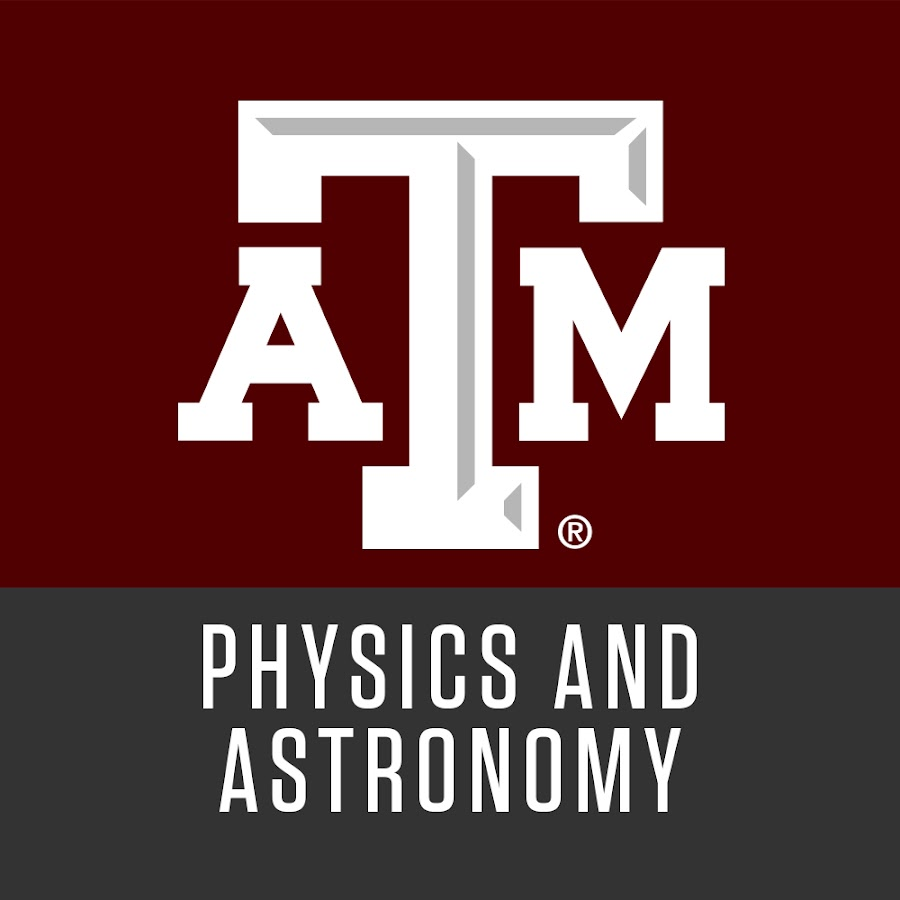

<h1 style="text-align: center;"> Hi! I’m Rishmita</h1>
<h3 style="text-align: center;" class="tag-line">A recent college grad looking to bring my multifaceted skills to the tech world</h3>

<section class="about-container">
  

    <h2 class="pop">About Me</h2>
    

      I’m a recent Texas A&M alumnus (whoop!) with a B.S. in Astrophysics and minors in Computer Science and Mathematics. Throughout university I took every opportunity to explore the expansive universe of software development and scientific programming, and I fell in love with learning new technologies to push the limits of my passions. 
    

  

  

    
  

</section>

<section class="tech-section">
  <h2>Skills</h2>

  

    

      <h3 class="tech-card-title">Programming Languages</h3>
      
Python · C/C++ · JavaScript/TypeScript · HTML/CSS · SQL

    

    

      <h3 class="tech-card-title">Fullstack Frameworks</h3>
      
React.js · Express.js · FastAPI · Jekyll

    

    

      <h3 class="tech-card-title">Data Science Frameworks</h3>
      
Pandas · NumPy · SciPy · Seaborn · Streamlit

    

    

      <h3 class="tech-card-title">ML/AI Frameworks</h3>
      
TensorFlow · TF Recommenders · OpenCV · LangChain · CrewAI

    

    

      <h3 class="tech-card-title">Tools & Databases</h3>
      
Git · Docker · Jupyter Notebook · Unix · PostgreSQL · REST APIs

    

    

      <h3 class="tech-card-title">Platforms</h3>
      
AWS · Docker

    

  

</section>

<section class="work-experience">
  <h2 class="pop">Work Experience</h2>

  <button class="accordion">
    
    

      <h3 class="tech-card-title">Laboratory Manager</h3>
      <h4 class="tech-card-text">TAMU Physics Lab Center</h4>
      <h5>June 2022 – Present</h5>
    

  </button>
  

    <ul>
      

        The Physics Lab Center (PLC) is responsible for designing, building, and maintaining physics demonstrations used in lectures and outreach events. I helped maintain our storeroom and workshop which houses over 200 demonstrations, covering topics such as thermodynamics, electricity and magnetism, classical mechanics, and modern physics. Another aspect of the job is updating the website where professors order demonstrations with demo descriptions and pictures. As I continued to work at the PLC I noticed many areas where updated technology could optimize a lot of our work on the employee side along with maximizing ease of use on the professor's side. This is why I’m currently working on updating the technology stack of our website and incorporating predictive models and agentic AI to better serve relevant demonstrations to professors. I’ve written more about these projects 
        <a href="/projects/project/2026/01/23/PLC_Website.html" target="_blank">here</a> (website update) and 
        <a href="/projects/project/2026/01/23/PLC_Agents.html" target="_blank">here</a> (PLC agentic AI).
        Properly documenting the storage and use of these physics demonstrations is especially important because these demonstrations are also presented during high-profile events like the TAMU Physics and Engineering Festival, which attract over 5,000 attendees annually.
      
 
      <h4 class="main-color" style="text-align:center;">Key Accomplishments</h4>
      <li><b>Optimized a database of 200+ physics demos using SQL and Python</b></li>
      <li><b>Integrated the demo ordering system with the Google Calendar API to notify employees of demo delivery details</b></li>
      <li><b>Built a CrewAI multi-agent system using LangChain and RAG algorithms to parse Google Docs and suggest demos with continuous updates</b></li>
      <li><b>Developed Python workflows for automated text summarization and resource classification with Streamlit dashboard visualizations</b></li>
    </ul>
  

  <button class="accordion">
        
    

      <h3 class="tech-card-title">Laboratory Member</h3>
      <h4 class="tech-card-text">AggieSat</h4>
      <h5>January 2022 – December 2025</h5>
    

  </button>
  

    <ul>
      

        At AggieSat Laboratory, I collaborated with a 30-member team to develop a project proposal for NASA’s PRISM solicitation. We prototyped a network of devices to establish a "lunar GPS system" capable of supporting future missions focused on lunar navigation, regolith composition studies, and building a lunar base camp.
        Additionally, I served as the Command and Data Handling (CDH) Subsystem Lead for the 20-member GeoRGE team in an internal rover competition. In this role, I led the design of the CDH subsystem by completing ranking verification matrices, budget sheets, and test verification documents. My team designed and programmed autonomous rover software utilizing computer vision algorithms and stereoscopic vision, enabling the rover to navigate terrain modeled after the surfaces of Mars and the Moon. Finally I joined the Machine Learning team where my team and I researched how to use ML models in space engineering systems and started ideating on models that improve the efficiency of the MUSIC algorithm - which is a frequency estimation and radio direction finding algorithm.
      

      <h4 class="main-color" style="text-align:center;">Key Accomplishments</h4>
      <li><b>Developed autonomous rover navigation software in C++ and Python with OpenCV following the V-model for iterative testing</b></li>
      <li><b>Maintained Requirement Verification Matrices and subsystem documentation</b></li>
      <li><b>Managed a $1,000 subsystem budget and coordinated hardware procurement and test planning</b></li>
    </ul>
  

  <button class="accordion">
        
    

      <h3 class="tech-card-title">Undergraduate Researcher</h3>
      <h4 class="tech-card-text">AggieSTAAR Research Experience</h4>
      <h5>May 2024 – August 2024</h5>
    

  </button>
  

    <ul>
      

        AggieSTAAR was a 10-week undergraduate research program where I did galaxy evolution research under Dr. Casey Papovich. The type of astrophysical research I did was essentially data engineering and data science — I cleaned large datasets, performed exploratory data analysis work on James Webb Space Telescope galaxy data, and I fit the galaxies relevant to my research to models of galaxy evolution. I also got to hone my data visualization skills by presenting my research at the 245th American Astronomical Society Meeting. I go more into the details of my research 
        <a href="/projects/project/2026/01/23/Galaxy_Research.html" target="_blank">here</a>.
      

      <h4 class="main-color" style="text-align:center;">Key Accomplishments</h4>
      <li><b>Analyzed 1,000+ JWST observations using Python (NumPy, Pandas, SciPy)</b></li>
      <li><b>Applied MCMC fitting with emcee and Astropy to model stellar populations</b></li>
      <li><b>Containerized pipeline with Docker, reducing setup from 8 hours to 1 hour</b></li>
    </ul>
  

</section>

<section class="projects">
  <h2>Projects</h2>
  <h4 class="project-subtitle">The projects more tied to my work experience are in the projects page. These are some personal and student org projects.</h4>
  <h5 class="project-subtitle-smaller">*project pages and WIP blogs regarding these projects will be coming soon!</h5>

  <button class="accordion project-accordion">
    Album of the Week Website & Discord Bot
    <a href="https://www.tamuaotw.com" target="_blank">www.tamuaotw.com</a>
  </button>
  

    

      Album of the Week is a book club, but for albums! I joined the org in its infancy and I joined the automation committee where I worked with a team of 3–5 people to develop a codebase to fully automate the voting, nomination, rating, and review process from Google Forms sheets to a centralized website. On top of that, because our organization facilitated a lot of music discussion on our Discord server the automation committee developed a Discord Bot that interfaced with our backend database.
    

    <h4 class="pop" style="text-align:center;">Key Accomplishments</h4>
    <ul>  
      <li><b>Developed JavaScript Discord bot with PostgreSQL integration for tracking posted song recommendations and updating weekly Spotify playlist</b></li>
      <li><b>Contributed to full-stack React.js + Express.js web app supporting album nominations, voting, and reviews</b></li>
      <li><b>Implemented asynchronous event handling and fail-safe scripts, applying AGILE sprints for iterative feature deployment</b></li>
    </ul>
  

  <button class="accordion project-accordion">
    Lifetime Albums Web Application
    <a href="https://github.com/RishmitaR/Album-Per-Year" target="_blank">github.com/RishmitaR/Album-Per-Year</a>
  </button>
  

    <ul>
      <li>Built full-stack web app using React.js, Express.js, and FastAPI for users to generate shareable album charts</li>
      <li>Created PostgreSQL database of 40,000+ ListenBrainz profiles for large-scale recommendations</li>
      <li>Trained a Two Tower Recommendation model with TensorFlow Recommenders to serve relevant albums to users; trained and deployed via AWS SageMaker</li>
      <li>Implemented OAuth login for Spotify and Last.fm and generated real-time feature vectors for model inference</li>
    </ul>
  

  <button class="accordion project-accordion">
    Cricanalytics
    <a href="https://github.com/Aran203/cricanalytics" target="_blank">github.com/Aran203/cricanalytics</a>
  </button>
  

    <ul>
      <li>Built an interactive Streamlit dashboard to analyze IPL 2023–2024 player performance</li>
      <li>Performed EDA with Pandas and created visualizations with Seaborn</li>
      <li>Developed a custom expected wickets metric using K-means clustering to evaluate bowling performance with data-driven insights</li>
    </ul>
  

</section>

